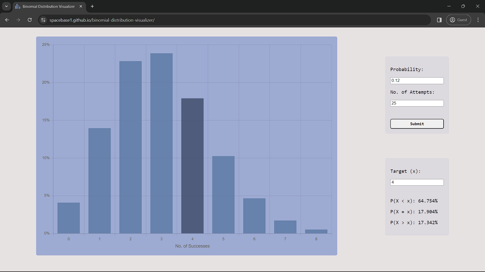

## Overview

- Calculates probabilities using the binomial distribution formula and makes a chart out of the results

## What can I use this for?

- Anything the binomial distribution formula can be used for
- Example – you want to calculate the probability that after throwing a dice ten times, you still get no 6

## How do I use this?

#### Basics

1. Input the *Probability* that a single event has to happen (e.g., a dice landing on 6 has a probability of 1/6, so you input 0.167)
2. Input the *No. of Attempts* (e.g., the dice is thrown ten times, so you input 10)
3. Click submit (or press enter)

- The chart shows the probability that you get 0 successes, 1 success, 2 successes and so on (the outcomes that have very low probabilities are hidden, but you can still view them via the *target (x)* feature)

#### Target

1. Input the desired *target (x)*, number of successes
2. Click away

- The first row under the input box shows the probability that you get less successes than *x*
- The second one shows the probability that you get exactly *x* successes
- The third one shows the probability that you get more successes than *x*